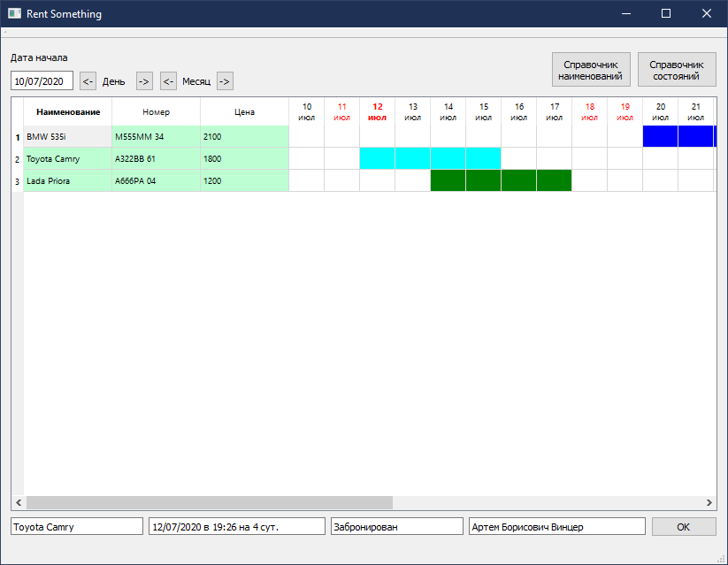
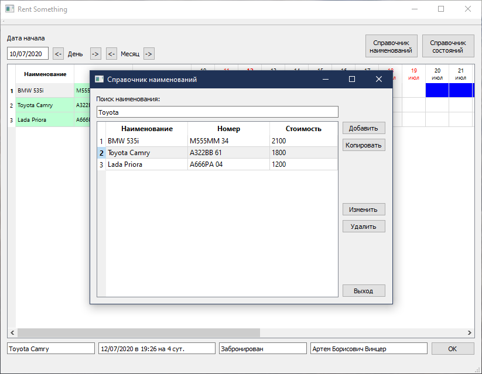
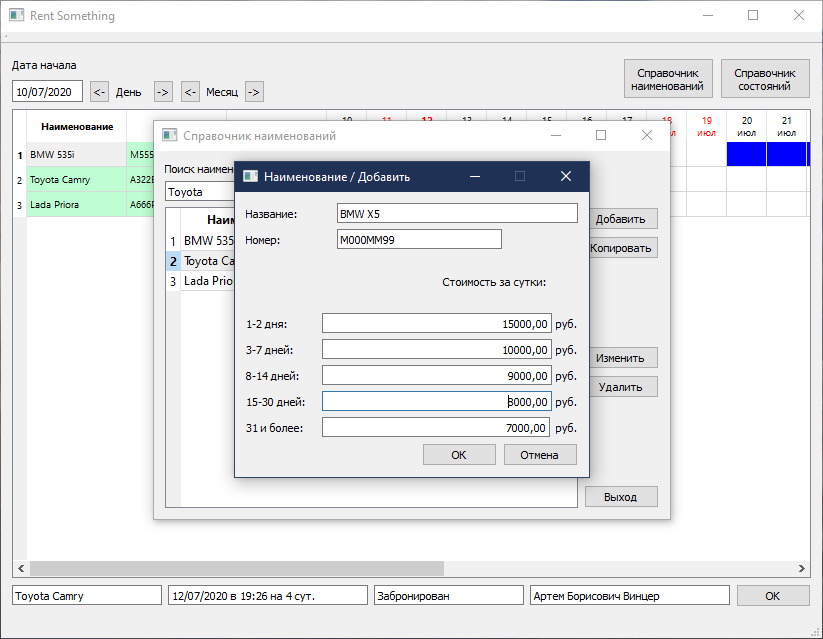
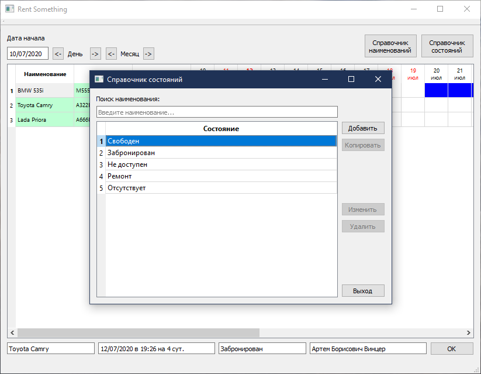
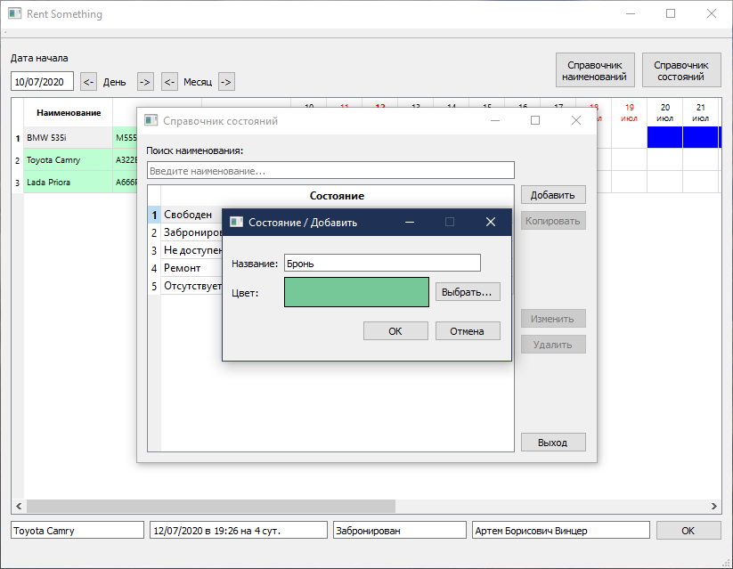
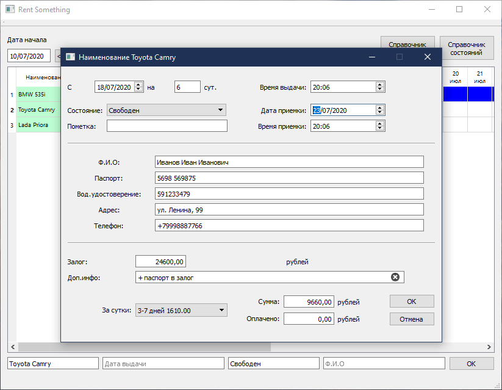

# Rent Something

Простая учетная система для предприятия, оказывающего услуги аренды/проката. Подойдет для аренды любого типа оборудования. Пример на скриншотах - аренда автомобилей.

Позволяет создать базу товаров проката, а также базу возможных состояний этих товаров, и на основе этого организовать ведение учета проката путем распределения единиц товара с помощью календаря.

Хранение данных - в файле.

Проект написан на языке C++ с использованием Qt 5. Скомпилирован в Visual Studio 2013. Platform Toolset v120. Qt5.5.

